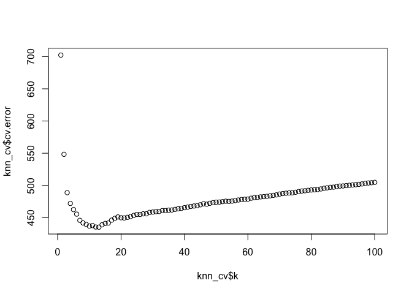
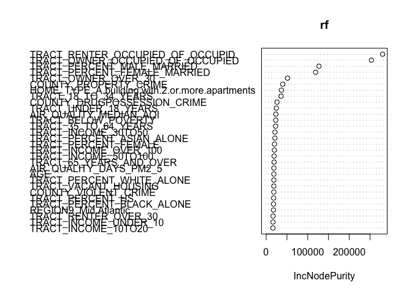

## Data download

Since ICPSR restricts redistribute the data, a proper way is to download the data to a local directory, for example, the project directory. Only codes and outputs should be push to Github. The data should be kept in the local. To download, use the email and password to login ICPSR.


```r
# download data from ICPSR to local directory
library(icpsrdata)
icpsr_download(file_id = 37516)
```


```r
# import downloaded data
load(file='icpsr_data/37516-0001-Data.rda')
raw <- da37516.0001
```

## Data cleaning


```r
# Drop missing data, sample size=4,090
data <- raw[complete.cases(raw[ , c("SMOKER_CATEGORY","ALCOHOL","TRACT_BELOW_POVERTY","TRACT_UNINSURED_OVER_65","TRACT_OWNER_OVER_30","TRACT_UNINSURED_UNDER_18","COUNTY_VIOLENT_CRIME")]),]

# Keep only needed columns
data <- data %>% 
  dplyr::select(starts_with("TRACT_")|starts_with("COUNTY_")|starts_with("AIR_")|all_of(c("AGE","GENDER","RACETHNICITY","EDUC4","MARITAL","EMPLOY","INCOME","REGION9","METRO","HOUSING","HOME_TYPE","SMOKER_CATEGORY","ALCOHOL","PHYSICIANS_TG_DOC","WALK_SCORE")))


# Impute those missing air quality data with median
data$missing.airdata <- factor(ifelse(is.na(data$AIR_QUALITY_MEDIAN_AQI), 1, 0),levels = c(1,0),labels = c("Yes","No"))
data$AIR_QUALITY_GOOD_DAYS <- ifelse(is.na(data$AIR_QUALITY_GOOD_DAYS), median(data$AIR_QUALITY_GOOD_DAYS,na.rm = TRUE), data$AIR_QUALITY_GOOD_DAYS)
data$AIR_QUALITY_MEDIAN_AQI <- ifelse(is.na(data$AIR_QUALITY_MEDIAN_AQI), median(data$AIR_QUALITY_MEDIAN_AQI,na.rm = TRUE), data$AIR_QUALITY_MEDIAN_AQI)
data$AIR_QUALITY_UNHEALTHY_FOR_SENSIT <- ifelse(is.na(data$AIR_QUALITY_UNHEALTHY_FOR_SENSIT), median(data$AIR_QUALITY_UNHEALTHY_FOR_SENSIT,na.rm = TRUE), data$AIR_QUALITY_UNHEALTHY_FOR_SENSIT)
data$AIR_QUALITY_DAYS_PM2_5<- ifelse(is.na(data$AIR_QUALITY_DAYS_PM2_5), median(data$AIR_QUALITY_DAYS_PM2_5,na.rm = TRUE), data$AIR_QUALITY_DAYS_PM2_5)
data$AIR_QUALITY_DAYS_PM10<- ifelse(is.na(data$AIR_QUALITY_DAYS_PM10), median(data$AIR_QUALITY_DAYS_PM10,na.rm = TRUE), data$AIR_QUALITY_DAYS_PM10)
```


```r
# Add dummy variables for categorical variables
for (x in c("GENDER","RACETHNICITY","MARITAL","EDUC4","EMPLOY","INCOME","HOUSING","ALCOHOL","METRO","HOME_TYPE","SMOKER_CATEGORY","REGION9")){
  lbls <- levels(data[[x]])
  levels(data[[x]]) <- sub("^\\([0-9]+\\) +(.+$)", "\\1", lbls)
}

dummy <- fastDummies::dummy_cols(data, remove_first_dummy=TRUE)

# Drop original categorical variables to make the final data
data <- dummy[ , !(names(dummy) %in% c("GENDER","RACETHNICITY","MARITAL","EDUC4","EMPLOY","INCOME","HOUSING","ALCOHOL","METRO","HOME_TYPE",
                                       "SMOKER_CATEGORY","REGION9", "missing.airdata"))]

# Revise variable names
names(data) <- make.names(names(data), unique=TRUE)

rm(dummy, da37516.0001)
```


```r
# Draw training sample, 50% training, 50% test data
set.seed(1)
train <- sample(1:nrow(data),nrow(data)/2)
```


## Linear Regression


```r
# Overall linear regression that include all variables
origin.lm <- lm(WALK_SCORE ~ ., data=data[train,])
pred.test.lm <- predict(origin.lm, newdata = data[-train,])
mean((pred.test.lm-data[-train,"WALK_SCORE"])^2)
```

```
## [1] 346.5994
```

```r
# Function to calculate test error with coefficient
func.coeftoerror <- function(coef){
  test.data <- data[-train,]
  te_x <- test.data %>% dplyr::select(names(coef)[-1])
  te_pred <- cbind(1, as.matrix(te_x)) %*% coef
  te_error <- mean((te_pred - test.data$WALK_SCORE)^2)
  selected.var <- paste(names(coef)[-1], collapse = ",")
  data.frame(test.error = te_error, n.var=length(names(coef))-1,selected.var=selected.var)
}

#SUBSET SELECTION
#identifying a subset of the predictors we believe to be related to response, fit a model using least squares on the reduced set of variables
#not using best subset due to number of variables, possible models to fit would be huge (2^107)
#perhaps hybrid approach of forward and backward stepwise, as it mimics best subset while retaining computational advantages of forward/backward stepwise
#but am running into issues with multicollinearlity? 

#best subset
#bs.fit <- regsubsets(WALK_SCORE~., data)
#too long

#forward, backward, hybrid
set.seed(1)

fwd.fit <- regsubsets(WALK_SCORE~., data=data[train,], method="forward", nvmax = 50)
```

```
## Warning in leaps.setup(x, y, wt = wt, nbest = nbest, nvmax = nvmax, force.in =
## force.in, : 5 linear dependencies found
```

```
## Reordering variables and trying again:
```

```r
bwd.fit <- regsubsets(WALK_SCORE~., data=data[train,], method="backward", nvmax = 50)
```

```
## Warning in leaps.setup(x, y, wt = wt, nbest = nbest, nvmax = nvmax, force.in =
## force.in, : 5 linear dependencies found
```

```
## Reordering variables and trying again:
```

```r
hybrid.fit <- regsubsets(WALK_SCORE~., data=data[train,],method="seqrep", nvmax = 50)
```

```
## Warning in leaps.setup(x, y, wt = wt, nbest = nbest, nvmax = nvmax, force.in =
## force.in, : 5 linear dependencies found
```

```
## Reordering variables and trying again:
```

```r
fwd.summary <- summary(fwd.fit)
bwd.summary<-summary(bwd.fit)
hybrid.summary<-summary(hybrid.fit)

# USE BIC as criteria when choosing the best model for each method
best.ind.fwd <- which.min(fwd.summary$bic)
best.ind.bwd <- which.min(bwd.summary$bic)
best.ind.hybrid <- which.min(hybrid.summary$bic)

best_coef.fwd <- coef(fwd.fit, best.ind.fwd)
best_coef.bwd <- coef(bwd.fit, best.ind.bwd)
best_coef.hybrid <- coef(hybrid.fit, best.ind.hybrid)

rbind(func.coeftoerror(best_coef.fwd),func.coeftoerror(best_coef.bwd),func.coeftoerror(best_coef.hybrid))
```

```
##   test.error n.var
## 1   405.2413    27
## 2   436.8136    26
## 3   432.4272    24
##                                                                                                                                                                                                                                                                                                                                                                                                                                                                                                                                                                                                                                                                          selected.var
## 1 TRACT_PERCENT_ASIAN_ALONE,TRACT_PERCENT_FEMALE_MARRIED,TRACT_PERCENT_UNDER_HS,TRACT_BELOW_POVERTY,TRACT_INCOME_UNDER_10,TRACT_POVERTY_FOOD_STAMP,TRACT_UNEMPLOYED,TRACT_OWNER_OVER_30,TRACT_UNDER_18_YEARS,TRACT_18_TO_34_YEARS,TRACT_UNINSURED_UNDER_18,COUNTY_DRUGPOSSESSION_CRIME,AIR_QUALITY_UNHEALTHY_FOR_SENSIT,AIR_QUALITY_MEDIAN_AQI,AIR_QUALITY_DAYS_PM10,GENDER_Male,RACETHNICITY_Hispanic,EDUC4_Bachelors.or.above,EMPLOY_Not.working...retired,REGION9_West.South.Central,METRO_Metro.Area,HOUSING_Rented.for.cash,HOUSING_Occupied.without.payment.of.cash.rent,HOME_TYPE_A.building.with.2.or.more.apartments,SMOKER_CATEGORY_Current.smoker,ALCOHOL_No,GENDER_Female
## 2                                                                       TRACT_PERCENT_BLACK_ALONE,TRACT_PERCENT_ASIAN_ALONE,TRACT_PERCENT_FEMALE_MARRIED,TRACT_PERCENT_UNDER_HS,TRACT_BELOW_POVERTY,TRACT_INCOME_UNDER_10,TRACT_INCOME_10TO20,TRACT_INCOME_30TO50,TRACT_INCOME_50TO100,TRACT_FOOD_STAMP,TRACT_UNEMPLOYED,TRACT_RENTER_OVER_30,TRACT_18_TO_34_YEARS,TRACT_UNINSURED_UNDER_18,AIR_QUALITY_MEDIAN_AQI,GENDER_Male,EDUC4_Bachelors.or.above,EMPLOY_Not.working...retired,REGION9_West.South.Central,REGION9_Mountain,REGION9_Pacific,METRO_Metro.Area,HOME_TYPE_A.one.family.house.attached.to.one.or.more.houses,SMOKER_CATEGORY_Current.smoker,ALCOHOL_No,GENDER_Female
## 3                                                                                                      TRACT_PERCENT_WHITE_ALONE,TRACT_PERCENT_BLACK_ALONE,TRACT_PERCENT_FEMALE_MARRIED,TRACT_PERCENT_UNDER_HS,TRACT_BELOW_POVERTY,TRACT_INCOME_UNDER_10,TRACT_POVERTY_FOOD_STAMP,TRACT_UNEMPLOYED,TRACT_RENTER_OVER_30,TRACT_18_TO_34_YEARS,TRACT_UNINSURED_UNDER_18,AIR_QUALITY_MEDIAN_AQI,GENDER_Male,RACETHNICITY_Hispanic,EDUC4_Bachelors.or.above,EMPLOY_Not.working...retired,REGION9_West.South.Central,REGION9_Mountain,REGION9_Pacific,METRO_Metro.Area,HOME_TYPE_A.one.family.house.attached.to.one.or.more.houses,SMOKER_CATEGORY_Current.smoker,ALCOHOL_No,GENDER_Female
```

```r
# selection methods may be inappropriate for our analysis because of multicollienarity in our data, we also used shrinkage methods
```


```r
#SHRINKAGE methods, fitting a model involving all predictors, estimated coefficients are shrunken towards zero relative to the least squares estimate, can also perform variable selection. 
#ridge:L2, lasso: L1

#ridge or LASSO? 
#i dont think we need ridge since it doesn't shrink variables to 0? but maybe we could talk about the variables that are close to 0? 

test <- (-train)
x <- as.matrix(subset(data, select = -WALK_SCORE))
y <- data$WALK_SCORE
y.test <- y[test]

#ridge
#cross validation to choose tuning parameter lambda
set.seed(1)
ridge.cv.out <- cv.glmnet(x[train,], y[train], alpha=0, nfolds = 5)
ridge.lam <- ridge.cv.out$lambda.min

#ridge regression with the selected lambda
ridge.pred <- predict(ridge.cv.out, newx=x[test,],s="lambda.min")
mean((ridge.pred-y.test)^2)
```

```
## [1] 343.7026
```

```r
ridge.coef.val <- predict(ridge.cv.out, type="coefficients", s="lambda.min")

#since ridge does not shrink towards 0 or peanlize as heavily as lasso, just looking at the variables that seem more sig
ridge.coef.ind <- which(abs(ridge.coef.val) >= 10) 
ridge.coef.names <- ridge.coef.val@Dimnames[[1]][ridge.coef.ind]
ridge.coef.tab <- cbind(ridge.coef.names, ridge.coef.val[ridge.coef.ind])

#LASSO
set.seed(1)

#cross validation to choose tuning parameter lambda
lasso.cv.out <- cv.glmnet(x[train,], y[train], alpha=1, nfolds = 5)
lasso.lam <- lasso.cv.out$lambda.min 

lasso.lr <- glmnet(x[train,], y[train], alpha=1, lambda=lasso.lam, thresh=1e-12)
lasso.pred <- predict(lasso.lr, newx=x[test,])
mean((lasso.pred-y.test)^2)
```

```
## [1] 341.1878
```

```r
lasso.coef <- predict(lasso.cv.out, type="coefficients", s=lasso.lam)       
lasso.coef
```

```
## 104 x 1 sparse Matrix of class "dgCMatrix"
##                                                                        s1
## (Intercept)                                                  7.585706e+01
## TRACT_PERCENT_FEMALE                                         .           
## TRACT_PERCENT_WHITE_ALONE                                    .           
## TRACT_PERCENT_BLACK_ALONE                                   -3.655349e+00
## TRACT_PERCENT_AM_INDIAN_ALONE                                .           
## TRACT_PERCENT_ASIAN_ALONE                                    1.625050e+01
## TRACT_PERCENT_MALE_MARRIED                                  -1.353425e+01
## TRACT_PERCENT_FEMALE_MARRIED                                -5.610388e+01
## TRACT_PERCENT_UNDER_HS                                       3.400074e+01
## TRACT_PERCENT_HS                                            -1.326149e+01
## TRACT_PERCENT_ANY_COLLEGE                                    .           
## TRACT_PERCENT_ANY_DEGREE                                     .           
## TRACT_PERCENT_ADVANCED_DEGREE                                1.818268e+01
## TRACT_BELOW_POVERTY                                         -3.092067e+01
## TRACT_INCOME_UNDER_10                                       -9.599864e+00
## TRACT_INCOME_10TO20                                          6.150300e+00
## TRACT_INCOME_20TO30                                          .           
## TRACT_INCOME_30TO50                                          .           
## TRACT_INCOME_50TO100                                        -6.089939e+00
## TRACT_INCOME_OVER_100                                        1.315807e+01
## TRACT_FOOD_STAMP                                             1.899763e+01
## TRACT_POVERTY_FOOD_STAMP                                     .           
## TRACT_UNEMPLOYED                                             .           
## TRACT_VACANT_HOUSING                                        -1.792649e+01
## TRACT_OWNER_OCCUPIED_OF_OCCUPIED                            -3.608926e+01
## TRACT_RENTER_OCCUPIED_OF_OCCUPID                             5.315975e-10
## TRACT_OWNER_OVER_30                                          1.672079e+01
## TRACT_RENTER_OVER_30                                         7.992290e-01
## TRACT_UNDER_18_YEARS                                        -3.138341e+01
## TRACT_18_TO_34_YEARS                                         .           
## TRACT_35_TO_64_YEARS                                         2.214785e+01
## TRACT_65_YEARS_AND_OVER                                      6.018207e+00
## TRACT_UNINSURED_UNDER_18                                    -3.604472e+00
## TRACT_UNINSURED_18TO34                                       .           
## TRACT_UNINSURED_35TO64                                       9.814818e+00
## TRACT_UNINSURED_OVER_65                                      8.494205e+00
## COUNTY_VIOLENT_CRIME                                         .           
## COUNTY_PROPERTY_CRIME                                       -3.810731e+02
## COUNTY_DRUGPOSSESSION_CRIME                                 -7.808671e+02
## COUNTY_DRUGSALE_CRIME                                        7.054915e+02
## AIR_QUALITY_GOOD_DAYS                                       -1.306494e-02
## AIR_QUALITY_UNHEALTHY_FOR_SENSIT                             2.741753e-02
## AIR_QUALITY_MEDIAN_AQI                                       .           
## AIR_QUALITY_DAYS_PM2_5                                       3.916650e-02
## AIR_QUALITY_DAYS_PM10                                        .           
## AGE                                                          .           
## PHYSICIANS_TG_DOC                                            1.086847e-01
## GENDER_Male                                                  .           
## GENDER_Female                                                .           
## RACETHNICITY_Black..non.Hispanic                            -1.650447e+00
## RACETHNICITY_Other..non.Hispanic                             .           
## RACETHNICITY_Hispanic                                        3.624899e+00
## RACETHNICITY_2...non.Hispanic                                .           
## RACETHNICITY_Asian..non.Hispanic                             7.983778e-01
## EDUC4_High.school.graduate.or.equivalent                     1.346646e+00
## EDUC4_Some.college                                           .           
## EDUC4_Bachelors.or.above                                     .           
## MARITAL_Widowed                                              5.997200e-01
## MARITAL_Divorced                                             8.272531e-01
## MARITAL_Separated                                            7.895040e-01
## MARITAL_Never.married                                        2.780060e+00
## MARITAL_Living.with.partner                                  .           
## EMPLOY_Working...self.employed                               .           
## EMPLOY_Not.working...on.temporary.layoff.from.a.job         -4.485363e+00
## EMPLOY_Not.working...looking.for.work                        .           
## EMPLOY_Not.working...retired                                -3.786253e-01
## EMPLOY_Not.working...disabled                                5.680565e-01
## EMPLOY_Not.working...other                                  -1.611726e+00
## INCOME_.5.000.to..9.999                                     -1.390130e+00
## INCOME_.10.000.to..14.999                                    .           
## INCOME_.15.000.to..19.999                                    1.119792e-01
## INCOME_.20.000.to..24.999                                   -8.026497e-02
## INCOME_.25.000.to..29.999                                    .           
## INCOME_.30.000.to..34.999                                    2.545511e+00
## INCOME_.35.000.to..39.999                                    9.571367e-01
## INCOME_.40.000.to..49.999                                   -6.967993e-01
## INCOME_.50.000.to..59.999                                    .           
## INCOME_.60.000.to..74.999                                    .           
## INCOME_.75.000.to..84.999                                    6.788945e-01
## INCOME_.85.000.to..99.999                                   -2.002391e-01
## INCOME_.100.000.to..124.999                                 -3.022544e-01
## INCOME_.125.000.to..149.999                                  .           
## INCOME_.150.000.to..174.999                                  1.812790e-01
## INCOME_.175.000.to..199.999                                 -1.162485e+00
## INCOME_.200.000.or.more                                      .           
## REGION9_Mid.Atlantic                                         1.040122e+01
## REGION9_East.North.Central                                   2.964155e+00
## REGION9_West.North.Central                                   5.783662e+00
## REGION9_South.Atlantic                                      -7.610772e+00
## REGION9_East.South.Central                                  -6.036421e+00
## REGION9_West.South.Central                                   .           
## REGION9_Mountain                                             5.482737e+00
## REGION9_Pacific                                             -1.017252e+00
## METRO_Metro.Area                                             .           
## HOUSING_Rented.for.cash                                      .           
## HOUSING_Occupied.without.payment.of.cash.rent                .           
## HOME_TYPE_A.one.family.house.attached.to.one.or.more.houses  4.413236e+00
## HOME_TYPE_A.building.with.2.or.more.apartments               7.334008e+00
## HOME_TYPE_A.mobile.home.or.trailer                          -1.860396e+00
## HOME_TYPE_Boat..RV..van..etc                                -4.814631e+00
## SMOKER_CATEGORY_Former.smoker                                .           
## SMOKER_CATEGORY_Current.smoker                               8.624703e-01
## ALCOHOL_No                                                   .           
## missing.airdata_No                                           4.147862e+00
```


## KNN for regression


```r
fit_std <- preProcess(data[train,], method = c("center","scale"))
train_std <- predict(fit_std, newdata = data[train,])
train_std$WALK_SCORE <- data[train,"WALK_SCORE"]
test_std <- predict(fit_std, newdata = data[-train,])
test_std$WALK_SCORE <- data[-train,"WALK_SCORE"]
set.seed(1)
fold_ind <- sample(1:5, nrow(data[-train,]), replace = TRUE)

knn_by_k <-  function(k) {
    cv.error <- mean(sapply(1:5, function(j){
    fit <- knnreg(WALK_SCORE ~ ., data = train_std[fold_ind != j, ], k = k)
    pred <- predict(fit, newdata = train_std[fold_ind == j, ])
    mean((train_std$WALK_SCORE[fold_ind == j] - pred)^2)
    }))
    data.frame(k=k, cv.error=cv.error)
  }
knn_cv <- do.call(rbind,lapply(1:100,knn_by_k))
plot(knn_cv$k,knn_cv$cv.error)
```

<!-- -->

```r
best_k <- knn_cv$k[knn_cv$cv.error==min(knn_cv$cv.error)]

knn.final <- knnreg(WALK_SCORE ~ ., data = train_std, k = best_k)
knn.pred <- predict(knn.final, newdata=test_std)
mean((knn.pred-data[-train,"WALK_SCORE"])^2)
```

```
## [1] 428.9768
```


## Random Forest

```r
rf <- randomForest(WALK_SCORE ~ ., data = data[train,])
yhat.rf <- predict(rf, newdata = data[-train,])
mean((yhat.rf-data[-train,"WALK_SCORE"])^2)
```

```
## [1] 250.2061
```

```r
varImpPlot(rf)
```

<!-- -->

## Boosting


```r
boost <- gbm(WALK_SCORE ~ .,data = data[train,], distribution = "gaussian", n.trees = 30000, interaction.depth = 1, cv.folds = 5, shrinkage = 0.01)
best_n_trees <- which.min(boost$cv.error)

yhat.boost <- predict(boost, newdata = data[-train,], n.trees = best_n_trees)
mean((yhat.boost - data[-train,"WALK_SCORE"])^2)
```

```
## [1] 297.788
```

